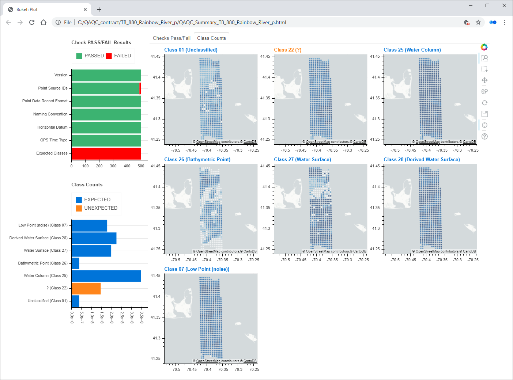

Output
******

The Checks portion of Q-Checker generates two outputs:

- QA/QC results shapefile
- QA/QC results dashboard

QA/QC results shapefile
-----------------------

The QA/QC results shapefile contains a polygon for each input LAS tile, along with the associated check results in the shapefile attribute table.  In the image below, the tiles are colored according to whether or not they passed the version test.

.. image:: ../../assets/images/qaqc_tiles_eg.PNG

QA/QC results dashboard
-----------------------

The QA/QC results dashboard is an HTML page that contains project-wide summary visualizations of the QA/QC results (see image below).

