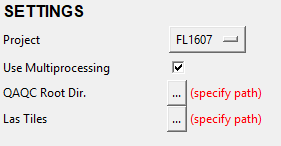

Workflow
********

The workflow consists of specifying the settings, checks, and surfaces and running the tool

1. Specify Settings
-------------------

- After selecting a project, you will need to specify the QAQC root and las tiles directories.

2. Specify Checks
-----------------

- Currently, only 3 of the checks are user-configurable.  The remaining 5 checks are fixed, as they either do not have more than one option or are automatically populated based on the selected option for other checks.

3. Specify Surfaces
-------------------

- Any combination of the 4 options can be checked.